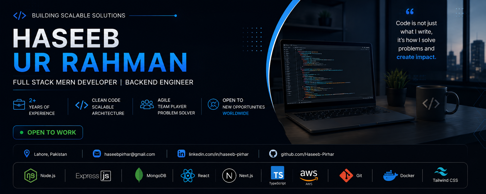

  

<h1 align="center">
  Hi 👋, I'm Haseeb Ur Rahman
</h1>

<h3 align="center">
Full Stack MERN Developer | Backend Engineer | Open to Work
</h3>

Building scalable web applications with Node.js, Express, MongoDB, React, Next.js and TypeScript.

  

//Badges

